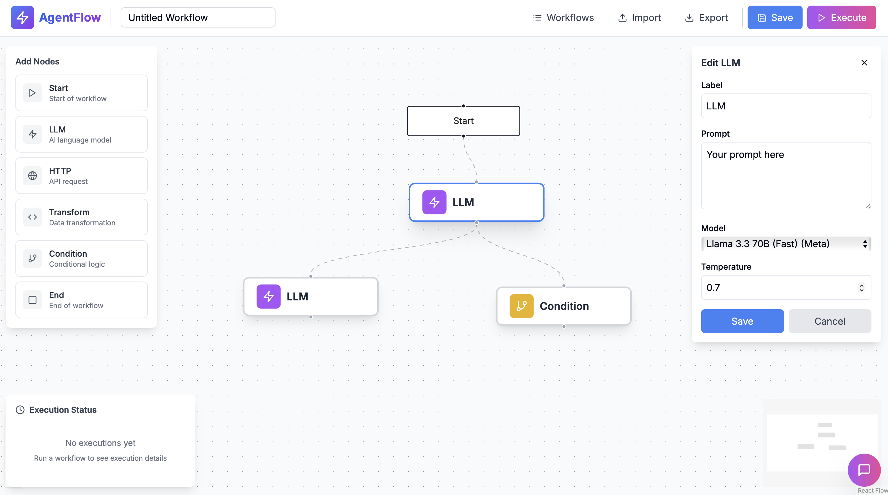

# AgentFlow - AI Workflow Automation



Visual drag-and-drop workflow builder powered by AI. Create complex automation workflows that run on Cloudflare's edge network with Llama 3.3, voice input, and real-time execution monitoring.

## Features

- **Visual Workflow Builder** - Drag-and-drop nodes with real-time execution
- **AI-Powered** - Llama 3.3 70B via Cloudflare Workers AI
- **Voice Input** - Speech-to-text using Whisper
- **Chat Assistant** - AI help with workflow design
- **Node Types** - LLM, HTTP, Transform, Condition, Start, End
- **Real-time Monitoring** - WebSocket execution updates
- **Template Variables** - `{{variable}}` syntax for dynamic data

## Quick Start

**Prerequisites:** Node.js 18+, Yarn, Cloudflare account

```bash
# Install
yarn install
cd worker && yarn install && cd ..

# Setup Cloudflare
npm install -g wrangler
wrangler login
wrangler kv namespace create WORKFLOWS_KV

# Update wrangler.toml with the KV ID from above

# Create .env.local
echo "NEXT_PUBLIC_WORKER_URL=http://localhost:8787" > .env.local

# Run (2 terminals)
yarn dev:worker  # Terminal 1
yarn dev         # Terminal 2

# Open http://localhost:3000
```

## Usage

1. Add nodes from the left panel
2. Connect nodes by dragging handles
3. Click nodes to configure
4. Save and Execute
5. Use `{{variable}}` for dynamic data
6. Click chat button for AI help

## Tech Stack

Next.js • React Flow • Cloudflare Workers • Durable Objects • Workers AI • Hono • TypeScript

## Deploy

```bash
yarn deploy:worker
yarn build && wrangler pages deploy .next
```

---

Built with ⚡ on Cloudflare
